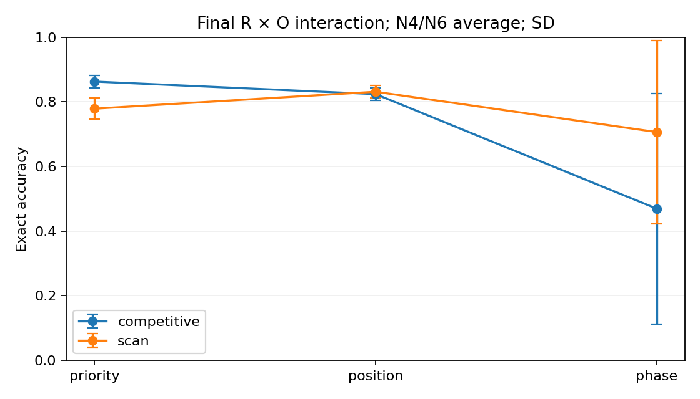

# Experiment A results: representation × readout compatibility

Status: completed, 2026-09-29. **A-COMPAT-6 — Unresolved. NOT READY FOR EXPERIMENT B.**

There is a significant behavioral R×O interaction under the fixed budget, but phase optimization is unstable and a nominal scan reader can reduce to masked sorting. The observed interaction cannot yet be attributed to intrinsic representation/readout compatibility. These limitations are results, not grounds for tuning or dropping failed seeds. No history/reset, coordination overlay, control comparison or hybrid was run.

## Design, provenance and matching

[Specification](experiment_A_representation_readout_compatibility.md) and [preregistration](experiment_A_preregistered_hypotheses.md) were committed at **7811085 before training**. [Source manifest](../experiment_A_source.json) identifies the exact training/evaluation code. The isolated `experiment_a/` package reuses the existing `SetLayer`; all legacy implementations and evidence remain unchanged. Later report/probe scripts analyze saved results only.

Every system uses hidden size 96, two attention layers, four heads, FF width 192, symbol/type embeddings and a ten-channel numeric projection. All have **164,162 parameters**: shared backbone **154,272**, head **9,890**, fixed adapters **0**. The six factorial cells assign the head to representation; the distributed reference assigns it to readout. Parameter differences are **0%**. The 37,056 unused relation/query/key parameters of the 201,218-parameter legacy regime model are omitted from every experimental system. This preserves its active scalar-task path, not its full multi-regime interface. Some embedding/numeric weights remain unused under this scalar-only task; all six have identical inactive columns. The reference additionally uses 288 step/used-feature input weights within its equal-sized head.

| System | Learned R | O (fixed except external reference) | C |
| --- | --- | --- | --- |
| Priority + Competitive | p=z0−z1; c=(max p−p)/range p | maximum −16c | hard used-item mask |
| Priority + Scan | same priority head/normalizer | maximum −16(c−q)² | same mask |
| Position + Competitive | u=sigmoid(z0−z1), c=u | maximum −16c | same mask |
| Position + Scan | same bounded coordinate | maximum −16(c−q)² | same mask |
| Phase + Competitive | phi=atan2(z1,z0), c=wrap(phi−anchor)/(2π) | maximum −16c | same mask |
| Phase + Scan | same onset-relative phase | maximum −16 wrapped-distance(c,q)² | same mask |
| Distributed reference | contextual item state | learned head of state, N and step/step²/used | same mask |

Cursor q=(step+0.5)/N; anchor starts at zero. There is no content bypass around the scalar/phase code in factorial cells. The reference is a step-conditioned set scorer, not a full token-autoregressive decoder. Matched capacity does not match numerical conditioning: bounded sigmoid, min/max normalization, atan2, a branch cut and circular distances have different optimization properties. Priority and position are related scalar parameterizations, not disjoint information capacities. Scalar sorting is a limited common task, not a neutral assay of every possible order computation.

Eight seeds: **11,22,33,44,55,66,77,88**. AdamW .001, weight decay .01, clip 1, batch 32, 900 steps, deterministic CPU, two threads. Alternating N4/N6 gives 14,400 training examples per load per run. Identical input streams across systems at each seed. Checkpoints 300/600/900. Each ID checkpoint/load has 1,024 paired held-out trials; rank-probe fits use a separate 256. Final interventions use 256 paired trials per load. No extra steps, sweep, width/depth change or rescue training. The reference seed11 sanity gate passed and was retained, not rerun.

## Behavioral results and interaction

Exact accuracy below is mean ± SD across eight seeds, in percent. Pairwise/tau average N4 and N6 equally. The external reference is excluded from the interaction.

| System | N4 exact | N6 exact | Pairwise | Kendall tau |
| --- | ---: | ---: | ---: | ---: |
| Priority + Competitive | 91.94 ± 1.48 | 80.63 ± 2.60 | .9860 | .9720 |
| Priority + Scan | 85.85 ± 2.03 | 69.93 ± 4.78 | .9711 | .9421 |
| Position + Competitive | 90.06 ± 1.22 | 74.74 ± 3.05 | .9820 | .9639 |
| Position + Scan | 90.22 ± 1.25 | 76.06 ± 2.73 | .9826 | .9652 |
| Phase + Competitive | 54.79 ± 39.35 | 39.09 ± 32.34 | .7821 | .5641 |
| Phase + Scan | 77.29 ± 30.22 | 64.00 ± 26.65 | .9156 | .8312 |
| Distributed reference | 92.22 ± 1.22 | 81.27 ± 3.00 | .9865 | .9729 |

Fixed N emissions plus the used-item mask guarantee zero omission, duplication and invalid-identity rates; these are structural properties, not learned content accuracy. First-error position uses zero-based position and N when correct, and is reported separately by N in CSV. Losses and score margins are not directly comparable as calibrated uncertainty because reader logit scales/curvatures differ.

The preregistered repeated-measures interaction gives **F(2,14)=4.7988**, within-seed permutation **p=.00355** (20,000 permutations). Mean scan-minus-competitive differences:

| R | Difference, percentage points | Seed SD | Bootstrap 95% CI |
| --- | ---: | ---: | ---: |
| Priority | −8.39 | 4.42 | [−11.43, −5.69] |
| Position | +0.74 | 1.69 | [−0.38, +1.76] |
| Phase | +23.71 | 35.98 | [+2.66, +49.37] |

The mean-difference range is **32.10 points**; phase-minus-priority difference has the same sign in 7/8 seeds. These are seed-level effects, not trial-pseudoreplicated significance. Permutation exchangeability is approximate under the conspicuous variance differences. The phase mean is particularly unrepresentative; preserve the per-seed table below. A small p-value cannot distinguish a code/readout compatibility constraint from optimization sensitivity in the chosen adapter.

## Seed and checkpoint dynamics

Final N4/N6 average exact percentages:

| System | 11 | 22 | 33 | 44 | 55 | 66 | 77 | 88 |
| --- | ---: | ---: | ---: | ---: | ---: | ---: | ---: | ---: |
| Priority/C | 84.08 | 85.30 | 85.01 | 87.21 | 89.70 | 85.64 | 84.86 | 88.48 |
| Priority/S | 81.93 | 79.69 | 76.22 | 77.10 | 80.08 | 76.66 | 79.93 | 71.53 |
| Position/C | 80.37 | 80.81 | 84.47 | 80.22 | 83.64 | 83.54 | 81.40 | 84.77 |
| Position/S | 80.42 | 82.32 | 84.67 | 82.96 | 86.33 | 81.20 | 82.76 | 84.47 |
| Phase/C | 72.02 | 10.25 | 62.35 | 74.80 | 80.32 | 73.00 | 2.64 | 0.10 |
| Phase/S | 81.79 | 1.56 | 83.94 | 81.01 | 83.59 | 70.36 | 86.77 | 76.17 |
| Reference | 83.79 | 87.79 | 90.14 | 85.79 | 88.72 | 85.16 | 86.87 | 85.69 |

Priority scan improves later than priority competition. Position reader differences become small by the end. Phase/C is unstable: seed22 is .611→.000→.103, seed77 .002→.663→.026, seed88 .671→.051→.001 across the three checkpoints. Phase/S seed22 remains .008→.015→.016; several other seeds learn later. All gradients/losses remained finite; this is not a numerical NaN failure. Branch-cut/conditioning problems are plausible explanations, not isolated causes proven by this run.

Descriptive interaction p-values at 300/600/900 are .4093/.00195/.00355. Only final was confirmatory. No checkpoint was selected to improve the conclusion. Training curves sample every 20th step, hence the alternating schedule's **N6** loss; validation loss covers both N values. [Convergence summary](../results/experiment_A/convergence_summary.csv) reports coarse first-checkpoint ≥.75 and mid-to-final changes, not continuous time-to-threshold.

## Representation and readout use

| System | Code-only pairwise decoding | Linear rank-probe pairwise | Swap inversion | Readout directional effect | Ablation exact drop | Functional seeds |
| --- | ---: | ---: | ---: | ---: | ---: | ---: |
| Priority/C | .9860 | .9860 | 1.000 | 1.000 | .8179 | 8/8 |
| Priority/S | .9782 | .9782 | 1.000 | .5669 | .7351 | 6/8 |
| Position/C | .9820 | .9820 | 1.000 | 1.000 | .7764 | 8/8 |
| Position/S | .9826 | .9826 | 1.000 | .1228 | .7861 | 0/8 |
| Phase/C | .7821 | .8737 | 1.000 | 1.000 | .4285 | 5/8 |
| Phase/S | .8820 | .8185 | 1.000 | .8633 | .6680 | 7/8 |

Directional readout effect means moving the last predicted item earlier after score boost for C; choosing a later original output slot after a one-slot cursor advance for S. These are different readout-specific assays, not directly comparable effect magnitudes. Swaps exchange first/last **model-predicted** item codes, not ground-truth labels. Exact output transposition is 1.000 except Position/S .999512; mean absolute item-rank movement is 1.5833 across N4/N6. Unrelated-item movement is zero except Position/S .000122. Content preservation is 1.000 by fixed identity routing. Failed phase runs can still show perfect swap effects: implemented causality is insufficient without correct ordinal content.

Phase coordinate decoding includes the onset anchor. A separate linear sin/cos probe need not agree with the imposed unwrapped ordering; e.g. the failed code may contain order information with the wrong orientation or sector. An unanchored circular difference cannot generally identify a unique first item. Secondary, trial-grouped two-fold sin/cos(Delta_phi) decoding reaches .8002 for Phase/C and .6698 for Phase/S, averaged across seeds/loads. This supplementary assay was added after main results and is labeled accordingly; it does not replace the preregistered anchored code criteria. Layer0/1/2 code diagnostics use the same final head at each encoder stage; they are descriptive emergence measures, not independently trained intermediate modules.

**Nominal scan can collapse to sorting.** Position/S fails the preregistered cursor threshold in all seeds. Saved-state replay, added as a post-main diagnostic without executing or changing model weights, finds its output matches ascending coordinate sort on **99.98%** of trials. Freezing its cursor at the first slot preserves **100%** of output sequences. Priority/S frozen-cursor preservation is **97.80%**, versus **0%** for Phase/S. Thus the one-slot perturbation threshold alone is not sufficient to establish that ongoing cursor advance normally drives serialization. Linear squared-distance scores can remain monotone over available codes; the used mask then supplies sequence progression. No universal hidden decoder is involved: the code bottleneck is intact, but intended readout roles need not remain distinct after learning.

## Invariance

All expected invariance interventions preserve 100% of sequences: positive-affine priority with normalization, matched-affine position/reference, phase rotations .37 and 2.1 **including the anchor**, and common score offset +3. Coordinate-transform logit differences stay below 4e−6; common-offset raw logits appropriately differ by 3. Items-only rotation is a negative control and changes output substantially. These are imposed mathematical properties confirmed numerically, not invariances independently discovered by training. The phase result does not establish anchor-free circular order.

## OOD without retraining

The ID stability gate allowed all cells except Phase/C (only five qualifying seeds). Eligible cells retain all eight seeds in OOD reporting, including the failed Phase/S seed; no survivor-only averages. Phase/C has explicit `ID_gate_failed` rows, not invented zero scores.

| System | N8 exact % ± SD | N10 | N12 |
| --- | ---: | ---: | ---: |
| Priority/C | 68.98 ± 4.04 | 53.65 ± 5.08 | 40.38 ± 6.55 |
| Priority/S | 54.20 ± 5.88 | 37.29 ± 5.90 | 22.88 ± 5.82 |
| Position/C | 58.19 ± 5.24 | 39.95 ± 6.47 | 25.93 ± 5.94 |
| Position/S | 60.72 ± 4.39 | 41.82 ± 3.65 | 25.59 ± 2.98 |
| Phase/C | not tested: ID gate | not tested | not tested |
| Phase/S | 50.52 ± 22.77 | 33.30 ± 17.51 | 20.61 ± 11.48 |
| Reference | 70.20 ± 4.91 | 56.01 ± 6.12 | 42.26 ± 6.71 |

Pairwise accuracy, Kendall tau and first-error position are preserved in [OOD CSV](../results/experiment_A_ood_length.csv). No representation has universal extrapolation support from this limited task. Step features N/10 and cursor spacing also extrapolate, so OOD does not isolate code geometry alone.

## Decision and limits

The numerical mechanistic gate identifies four cells, covering all three R and both O families. Nevertheless the preregistered **confound precedence** applies: phase late failures materially contribute to the interaction, and nominal linear scans often do not require cursor advance. The rule-only pre-review label is A-COMPAT-2; after the required qualitative confound review the single primary classification is **A-COMPAT-6**. [Review record](experiment_A_confound_review.json) preserves that reasoning; thresholds and raw results were not changed.

This is useful evidence that parameter matching and an R/O software interface do not guarantee a functional factorial. It does not establish intrinsic incompatibility, a global winner, novelty of cross-pairs, or a neural mechanism. Further diagnosis may be proposed later, but no redesign or tuning was performed here. **NOT READY FOR EXPERIMENT B.**

## Artifacts and reproduction

- Primary data: [factorial](../results/experiment_A_main_factorial.csv), [representations](../results/experiment_A_representation_diagnostics.csv), [interventions](../results/experiment_A_interventions.csv), [invariances](../results/experiment_A_invariance.csv), [OOD](../results/experiment_A_ood_length.csv).
- [Result index](../results/experiment_A/README.md) links 12 plots, seed tables, statistics and secondary analyses. CSV units are fractions unless otherwise named; this summary converts exact scores to percent.
- Raw runs and 168 checkpoints: `runs/experiment_A/<system>/<seed>/`; local and retained remote copy at `/mnt/SAM1TB/dev/projects/oscillation-trans-experiment-a-20260929/runs/experiment_A/`. Source hashes, configs, RNG/optimizer states, trial arrays and logs are preserved. Raw checkpoint files are ignored, not silently deleted or committed as binaries.
- Fixed training: `python -m experiment_a.run --system reference --seed 11`, then `--worker 0/1/2`; gated inference `python -m experiment_a.run --ood`. These commands refuse run overwrite. Do not run them merely to rebuild reports.
- Local report rebuild: `python -m experiment_a.report`; `python -m experiment_a.inspect_codes`. Requires Python, NumPy, pandas and Matplotlib; no training or checkpoint load. Remote training/tests use pinned Linux amd64 CPU torch image described in the specification. Validation and hashes are recorded in `results/experiment_A/verification.json`.
